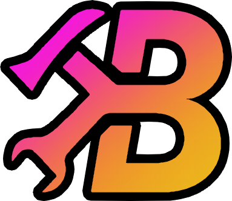

#  BetterEdit

  
  &ensp;&macr;&ensp;
  
  
  &ensp;&macr;&ensp;
  
  
  &ensp;&macr;&ensp;
  

A mod that makes the <a href="https://store.steampowered.com/app/322170/Geometry_Dash/">Geometry Dash</a> editor, well, <i>better</i>.

## :rocket: Installation

You can install BetterEdit through [Geode](https://geode-sdk.org). After installing Geode, simply search for the mod on the in-game browser, and click install.

**BetterEdit needs the following mods to also be installed:**

 * [NodeIDs](https://github.com/geode-sdk/NodeIDs)
 * [Custom Keybinds (Windows only)](https://github.com/geode-sdk/CustomKeybinds)
 * [GMD API](https://github.com/HJfod/GMD-API)
 * [BetterSave](https://github.com/HJfod/BetterSave)

## :beetle: Bug reports & feature suggestions

You can use [Issues](https://github.com/HJfod/BetterEdit/issues) to report bugs and suggest new features! Click [here](https://github.com/HJfod/BetterEdit/issues/new/choose) to open up a new issue.

Please use the correct templates for your issue - badly formatted issues will be closed.

| Issue template name | What it's for |
| ------------------- | ------------- |
| Bug Report          | Reporting a bug with the mod, such as some feature not working as expected, some buttons being misplaced, etc. |
| Crash Report        | Reporting a crash with the mod (i.e. when the game closes unexpectedly) |
| Suggestion          | Suggesting a new feature to be added to the mod / changes to an existing feature |

## :speech_balloon: Contact

BetterEdit has a [Discord server](https://discord.gg/rPvFW4jQTJ); this is where you can go if you need any further information, wish to ask questions, or anything else!

You can also contact the developer of the mod (HJfod) directly through Discord or Twitter/X.

 * Discord: `@hjfod`
 * Twitter: [`hjfod`](https://twitter.com/hjfod)

## :euro: Support

BetterEdit's development is supported via [donations on my Ko-fi](https://ko-fi.com/hjfod)!

There is also plans for a paid version called **BetterEdit Pro** in the future, however details on that will be coming later.

## :balance_scale: Licensing

**BetterEdit is licensed under the [LGPLv3](https://www.gnu.org/licenses/lgpl-3.0.en.html) license.**

This means **you cannot create closed-source versions of BetterEdit**. You, however, *can* create separate closed-source mods that depend on BetterEdit.

This is to ensure that nobody piggybacks off the hundreds of hours of work spent by myself and other developers, without providing proper credit in the form of the free version! :blush:
